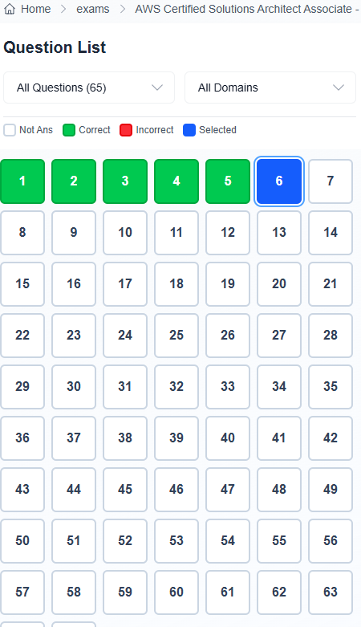

### 📸 Minh chứng (Screenshot)

### 📝 Tóm tắt 5 câu đã làm
1. **Câu 1:** A company needs to review its AWS Cloud deployment to ensure that its Amazon S3 buckets do not have unauthorized configuration changes.
What should a solutions architect do to accomplish this goal?

- Kiến thức rút ra:
    Để verify thay đổi realtime thì cần dùng AWS Config.
    Các option khác k phù hợp như trust advisor thì cái này quét issue tĩnh như Security, cost, .. theo tgian lên lịch sẵn, k realtime.
    Inspector thì quét vul, risk, ...

2. **Câu 2:** A company needs the ability to analyze the log files of its proprietary application. The logs are stored in JSON format in an Amazon S3 bucket. Queries will be simple and will run on-demand. A solutions architect needs to perform the analysis with minimal changes to the existing architecture.
What should the solutions architect do to meet these requirements with the LEAST amount of operational overhead?
- Kiến thức rút ra:
    Để giá rẻ, chi phí vận hành ít, có thể query nhanh gọn trên s3 bucket thì dùng Athena.
    Athena là dịch vụ serverless, k cần cài cắm, tính theo on-demand khi chạy query.
    AWS Glue có thể dùng nhưng cần cài hệ thống, tốn chi phí vận hành, phù hợp hơn vs các query phức tạp.

3. **Câu 3:** A company is running an SMB file server in its data center. The file server stores large files that are accessed frequently for the first few days after the files are created. After 7 days the files are rarely accessed.
The total data size is increasing and is close to the company's total storage capacity. A solutions architect must increase the company's available storage space without losing low-latency access to the most recently accessed files. The solutions architect must also provide file lifecycle management to avoid future storage issues.
Which solution will meet these requirements?
- Kiến thức rút ra:
    Sẽ cần dùng đến S3 để tăng storage nhanh .
    Vậy dùng S3 file gateway để cắm S3 vào thành SMB, thì storage gần như vô hạn do backup lên S3.
    Cache các file mới và hay dùng ở local để giảm latency, khi dùng ít sẽ tự sync ngược lên S3.
    S3 config thêm lifecycle là sẽ tự động move data sau 7 ngày về glacier deep archive để giảm cost.

4. **Câu 4:** A company has a website hosted on AWS. The website is behind an Application Load Balancer (ALB) that is configured to handle HTTP and HTTPS separately. The company wants to forward all requests to the website so that the requests will use HTTPS.
What should a solutions architect do to meet this requirement?
- Kiến thức rút ra:
    Khi web chỉ chấp nhận https , k chấp nhận http thì phải có rule auto redirect http -> https dù request gì.
    Cần tạo listener rule cho ALB để tự redirect.
    Và rule này chỉ hỗ trợ routing, redirect, .. chứ k thể replacement nên k thay http -> https ở url đc.

5. **Câu 5:** A company is developing an application that provides order shipping statistics for retrieval by a REST API. The company wants to extract the shipping statistics, organize the data into an easy-to-read HTML format, and send the report to several email addresses at the same time every morning.
Which combination of steps should a solutions architect take to meet these requirements? (Choose two.)
- Kiến thức rút ra:
    Để gửi mail cần SES (simple email service) và định kì the same time thì cần eventbridge để lên lịch.
    Retrieval vs API thì cần lambda.
    Tổng kết là eventbridge sẽ cần setup lịch đúng giờ để trigger lambda,
    Lambda call API để lấy data và đẩy info html formatted sang SES để gửi mail.

